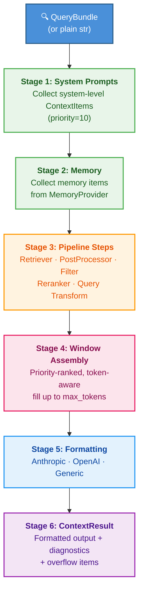
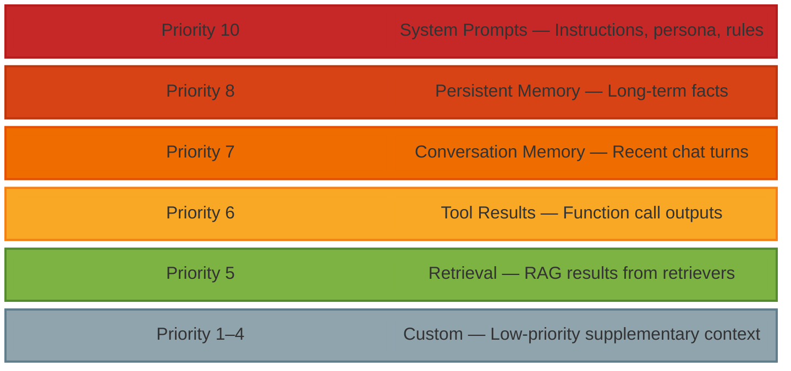

# System Architecture

This page describes the internal architecture of `astro-context` -- how the
`ContextPipeline` assembles context from multiple sources, ranks it by
priority, enforces token budgets, and produces a formatted result.

## Pipeline Flow

Every call to `pipeline.build()` (or `await pipeline.abuild()`) executes a
six-stage pipeline:



## Stage Details

### Stage 1: System Prompts

System prompts are registered via `pipeline.add_system_prompt()` and stored
as `ContextItem` objects with `source=SourceType.SYSTEM` and `priority=10`
(the highest default priority). They are always included first.

```python
from astro_context import ContextPipeline

pipeline = (
    ContextPipeline(max_tokens=8192)
    .add_system_prompt("You are a helpful assistant.", priority=10)
    .add_system_prompt("Always respond in markdown.", priority=9)
)
```

### Stage 2: Memory Collection

If a `MemoryProvider` is attached via `pipeline.with_memory()`, the pipeline
calls `memory.get_context_items()` to collect conversation history and
persistent facts. These items are added to the pipeline's item list before
any retrieval steps execute.

When a `ContextQueryEnricher` is also attached, the pipeline enriches the
query string with memory context before passing it to downstream steps.

### Stage 3: Pipeline Steps

Steps execute sequentially in registration order. Each step receives the
current list of `ContextItem` objects and the `QueryBundle`, and returns a
new (or modified) list.

Three categories of steps exist:

| Step Type | Behavior | Factory Function |
|-----------|----------|------------------|
| Retriever | Appends new items from a search backend | `retriever_step()` |
| PostProcessor | Transforms existing items (filter, rerank, dedupe) | `postprocessor_step()` |
| Filter | Removes items that fail a predicate | `filter_step()` |
| Reranker | Re-scores and selects top-k items | `reranker_step()` |
| Query Transform | Expands query, retrieves per variant, merges via RRF | `query_transform_step()` |
| Classified | Classifies query, routes to a matching retriever | `classified_retriever_step()` |

Steps can also be registered using the decorator API:

```python
pipeline = ContextPipeline(max_tokens=8192)

@pipeline.step
def boost_recent(items, query):
    return [
        item.model_copy(update={"score": min(1.0, item.score * 1.5)})
        if item.metadata.get("recent") else item
        for item in items
    ]
```

Each step has an `on_error` policy: `"raise"` (default) aborts the pipeline,
while `"skip"` logs a warning and continues with the previous item list.

### Stage 4: Window Assembly

After all steps complete, the pipeline counts tokens for any items that lack
a `token_count`, then assembles the `ContextWindow`:

1. If a `TokenBudget` is configured with per-source allocations, items are
   pre-filtered by source caps (using `"truncate"` or `"drop"` overflow
   strategies).
2. Remaining items are sorted by `(-priority, -score)`.
3. Items are added to the window one by one until `max_tokens` is reached.
4. Items that do not fit are tracked as `overflow_items`.

```python
from astro_context import ContextWindow, ContextItem, SourceType

window = ContextWindow(max_tokens=4096)
overflow = window.add_items_by_priority([
    ContextItem(content="System prompt", source=SourceType.SYSTEM, priority=10, token_count=20),
    ContextItem(content="A retrieval result", source=SourceType.RETRIEVAL, priority=5, token_count=100),
])
print(f"Utilization: {window.utilization:.1%}")  # e.g. "Utilization: 2.9%"
```

### Stage 5: Formatting

The assembled `ContextWindow` is passed to the configured `Formatter`. Three
built-in formatters are provided:

- **`AnthropicFormatter`** -- produces `{"system": "...", "messages": [...]}`
- **`OpenAIFormatter`** -- produces `{"messages": [{"role": "system", ...}, ...]}`
- **`GenericTextFormatter`** -- produces a plain text string (default)

### Stage 6: ContextResult

The final output is a `ContextResult` containing:

| Field | Type | Description |
|-------|------|-------------|
| `window` | `ContextWindow` | The assembled items with token accounting |
| `formatted_output` | `str \| dict` | Ready-to-use output for the LLM API |
| `format_type` | `str` | Formatter identifier (`"anthropic"`, `"openai"`, `"generic"`) |
| `overflow_items` | `list[ContextItem]` | Items that did not fit in the window |
| `diagnostics` | `PipelineDiagnostics` | Per-step timing, counts, utilization |
| `build_time_ms` | `float` | Total pipeline execution time in milliseconds |

## Priority System

Every `ContextItem` has a `priority` field (1--10) that controls placement
order in the context window. Higher priority items are placed first and are
never evicted in favor of lower priority items.

| Priority | Source | Usage |
|----------|--------|-------|
| 10 | System prompts | Instructions, persona, rules |
| 8 | Persistent memory | Long-term facts from `MemoryManager.add_fact()` |
| 7 | Conversation memory | Recent chat turns from `SlidingWindowMemory` |
| 6 | Tool results | Tool/function call outputs |
| 5 | Retrieval (default) | RAG results from retrievers |
| 1--4 | Custom | Low-priority supplementary context |



When the total context exceeds `max_tokens`, the pipeline fills from highest
priority down. Items that do not fit are tracked in `result.overflow_items`.

## Diagnostics

Every `ContextResult` includes a `diagnostics` dict typed as
`PipelineDiagnostics`. This provides full observability into the build:

```python
result = pipeline.build("What is context engineering?")
d = result.diagnostics

# Per-step timing and item counts
for step in d.get("steps", []):
    print(f"  {step['name']}: {step['items_after']} items in {step['time_ms']:.1f}ms")

# Overall stats
print(f"Items considered: {d.get('total_items_considered', 0)}")
print(f"Items included:   {d.get('items_included', 0)}")
print(f"Items overflow:   {d.get('items_overflow', 0)}")
print(f"Utilization:      {d.get('token_utilization', 0):.1%}")
```

Available diagnostic fields:

| Field | Type | Description |
|-------|------|-------------|
| `steps` | `list[StepDiagnostic]` | Per-step name, item count, timing |
| `memory_items` | `int` | Number of items from the memory provider |
| `total_items_considered` | `int` | Items entering window assembly |
| `items_included` | `int` | Items that fit in the window |
| `items_overflow` | `int` | Items that did not fit |
| `token_utilization` | `float` | Fraction of token budget used (0.0--1.0) |
| `token_usage_by_source` | `dict[str, int]` | Token count per source type |
| `shared_pool_usage` | `int` | Tokens used by uncapped sources |
| `skipped_steps` | `list[str]` | Steps that failed with `on_error="skip"` |
| `failed_step` | `str` | Step that caused a pipeline failure |
| `query_enriched` | `bool` | Whether the query was enriched with memory |
| `budget_overflow_by_source` | `dict[str, int]` | Items dropped per source by budget |

## Sync vs Async Execution

The pipeline supports two execution modes:

**Synchronous** (`build()`): All steps must be synchronous. Async steps
raise a `TypeError` at execution time.

```python
result = pipeline.build("What is context engineering?")
```

**Asynchronous** (`abuild()`): Supports both sync and async steps. Sync
steps are called directly; async steps are awaited.

```python
result = await pipeline.abuild("What is context engineering?")
```

This allows mixing sync retrievers (e.g., in-memory BM25) with async
retrievers (e.g., database lookups) in the same pipeline:

```python
pipeline = ContextPipeline(max_tokens=8192)

@pipeline.step  # sync
def add_bm25_results(items, query):
    return items + bm25_search(query.query_str)

@pipeline.async_step  # async
async def add_db_results(items, query):
    results = await db.search(query.query_str)
    return items + results

result = await pipeline.abuild("search query")
```

!!! tip "When to use `abuild()`"
    Use `abuild()` whenever your pipeline includes at least one async step
    (database lookups, API calls, async rerankers). For pure in-memory
    pipelines, `build()` avoids the overhead of an event loop.

## Callbacks

The pipeline fires events at key points via `PipelineCallback` objects.
Register callbacks with `pipeline.add_callback()`:

```python
from astro_context.pipeline.callbacks import PipelineCallback

class TimingLogger:
    def on_step_end(self, step_name, items, time_ms):
        print(f"{step_name}: {time_ms:.1f}ms ({len(items)} items)")

    def on_pipeline_end(self, result):
        print(f"Total: {result.build_time_ms:.1f}ms")

pipeline.add_callback(TimingLogger())
```

Available callback hooks:

- `on_pipeline_start(query)` -- fired before any processing
- `on_step_start(step_name, items)` -- fired before each step
- `on_step_end(step_name, items, time_ms)` -- fired after each step
- `on_step_error(step_name, error)` -- fired when a step raises
- `on_pipeline_end(result)` -- fired after the final `ContextResult` is assembled

!!! note
    Callback errors are swallowed and logged at WARNING level. A failing
    callback never breaks the pipeline.

## See Also

- [Token Budget Management](token-budgets.md) -- fine-grained token allocation
- [Protocol-Based Architecture](protocols.md) -- how plugins connect
- [Pipeline Guide](../guides/pipeline.md) -- practical usage examples
